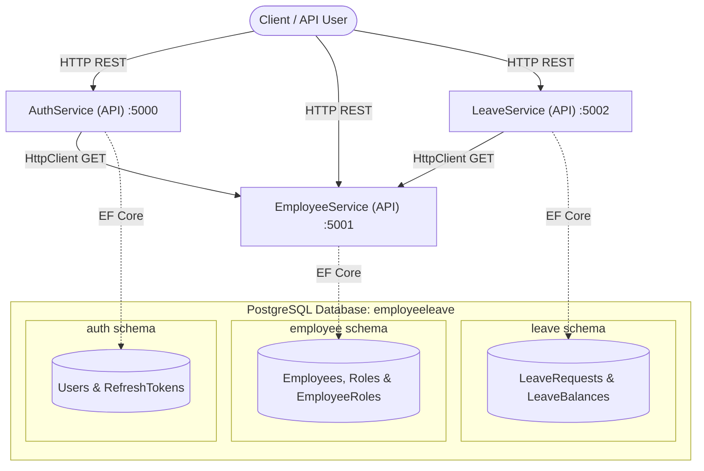

# Leave Management System - System Architecture

This document describes the high-level architecture, service boundaries, database design, domain models, and inter-service communication protocols for the **Leave Management System**.

---

## 1. System Overview

The system is built as a microservices architecture targeting **.NET 10.0** and **ASP.NET Core**. It is designed around **Clean Architecture (Onion Architecture)** principles to separate concerns and ensure testability and scalability.



---

## 2. Directory & Folder Structure

Each service is structured into four project layers following **Clean Architecture**:

*   **`<Service>.API` (Presentation Layer)**: Handles incoming HTTP requests, controllers, application bootup config (`Program.cs`), routing, JWT middleware authentication, logging, and environment configurations.
*   **`<Service>.Application` (Application Layer)**: Houses the business logic interfaces, DTOs (Data Transfer Objects), request validators (using FluentValidation), exceptions, and application service definitions.
*   **`<Service>.Domain` (Domain Layer)**: The core of the service, containing entity models (`BaseEntity`), enums, and repository interfaces. It has zero external dependencies.
*   **`<Service>.Infrastructure` (Infrastructure Layer)**: Implements database storage using Entity Framework Core, handles repository and unit-of-work concrete implementations, and contains external service clients (e.g., HTTP clients to other services).

### High-level File Map

```text
LeaveManagement/
├── AuthService/
│   ├── Auth.API/                # Controllers, Program.cs, ExceptionMiddleware
│   ├── Auth.Application/        # Register/Login Request/Response DTOs & Validators
│   ├── Auth.Domain/             # User and RefreshToken Entities, IUserRepository
│   └── Auth.Infrastructure/     # ApplicationDbContext, JwtTokenService, EmployeeClient
├── EmployeeService/
│   ├── Employee.API/            # Employee & Role Controllers, Program.cs
│   ├── Employee.Application/    # Create/Update DTOs & Validators
│   ├── Employee.Domain/         # Employee, Role, EmployeeRole Entities
│   └── Employee.Infrastructure/ # ApplicationDbContext (employee schema), Repositories
└── LeaveService/
    ├── Leave.API/               # Leave & LeaveBalance Controllers, ClaimsExtensions
    ├── Leave.Application/       # CreateLeaveRequest DTOs & Validators
    ├── Leave.Domain/            # LeaveRequest & LeaveBalance Entities, LeaveStatus Enum
    └── Leave.Infrastructure/    # ApplicationDbContext (leave schema), EmployeeClient
```

---

## 3. Database Architecture & Schema Isolation

All services connect to a single **PostgreSQL** database instance (`employeeleave`), but they are logically separated using **PostgreSQL Database Schemas** to maintain bounded contexts and prevent schema pollution:

| Service | Schema | Key Tables | EF Core Configuration |
| :--- | :--- | :--- | :--- |
| **AuthService** | `auth` | `Users`, `RefreshTokens` | `modelBuilder.HasDefaultSchema("auth");` |
| **EmployeeService** | `employee` | `Employees`, `Roles`, `EmployeeRoles` | `modelBuilder.HasDefaultSchema("employee");` |
| **LeaveService** | `leave` | `LeaveRequests`, `LeaveBalances` | `modelBuilder.HasDefaultSchema("leave");` |

---

## 4. Entity Models & Relationships

Since microservices maintain boundary isolation, references across schemas (e.g., from `User` to `Employee`) are represented as logical IDs rather than hard foreign keys in the database.

### 4.1 AuthService (schema: `auth`)
*   **`User`** (inherits `BaseEntity`): Represents credentials and accounts.
    *   `Id` (int, PK)
    *   `Email` (string, Unique Index)
    *   `PasswordHash` (string)
    *   `IsActive` (bool)
    *   `EmployeeId` (int?, Nullable logical reference to `employee.Employee.Id`)
*   **`RefreshToken`**: Used for securing OAuth/JWT renewal.
    *   `Id` (int, PK)
    *   `UserId` (int, FK to `User.Id`)
    *   `Token` (string)
    *   `ExpiresAt` (DateTime)
    *   `IsRevoked` (bool)
    *   `CreatedAt` (DateTime)
    *   *Relationship*: `User` has one-to-many `RefreshTokens`.

### 4.2 EmployeeService (schema: `employee`)
*   **`Employee`** (inherits `BaseEntity`): Stores employee details.
    *   `Id` (int, PK)
    *   `UserId` (int, Unique Index, logical reference to `auth.User.Id`)
    *   `FirstName` (string)
    *   `LastName` (string)
    *   `Department` (string)
    *   `ManagerId` (int?, self-referential FK to `Employee.Id`)
    *   `IsActive` (bool)
    *   *Relationship*: Self-referencing tree (an Employee has one Manager who is also an Employee).
*   **`Role`** (inherits `BaseEntity`): Security roles.
    *   `Id` (int, PK)
    *   `Name` (string)
*   **`EmployeeRole`** (Join Table): Many-to-many mapping between Employee and Role.
    *   `EmployeeId` (int, Composite PK / FK to `Employee.Id`)
    *   `RoleId` (int, Composite PK / FK to `Role.Id`)

### 4.3 LeaveService (schema: `leave`)
*   **`LeaveRequest`** (inherits `BaseEntity`): Records an employee's requested time off.
    *   `Id` (int, PK)
    *   `EmployeeId` (int, Logical reference to `employee.Employee.Id`)
    *   `StartDate` (DateTime)
    *   `EndDate` (DateTime)
    *   `Reason` (string, MaxLength 500)
    *   `Status` (Enum: `Pending` | `Approved` | `Rejected`)
    *   `ProcessedBy` (int?, Logical reference to `employee.Employee.Id` of the approver)
*   **`LeaveBalance`** (inherits `BaseEntity`): Tracks remaining leave days per year.
    *   `Id` (int, PK)
    *   `EmployeeId` (int, Logical reference to `employee.Employee.Id`)
    *   `Year` (int)
    *   `TotalLeaves` (int)
    *   `UsedLeaves` (int)
    *   `RemainingLeaves` (int, Computed property: `TotalLeaves - UsedLeaves`)
    *   *Unique Constraint*: Unique compound index on `(EmployeeId, Year)`.

---

## 5. Inter-Service Communication

Inter-service communication is synchronous and utilizes HTTP REST calls via configured typed `HttpClient` wrappers:

### 5.1 Communication Paths
1.  **`AuthService` $\rightarrow$ `EmployeeService`**:
    *   During JWT token generation, `AuthService` queries `EmployeeService` to fetch the User's associated roles and their `EmployeeId`.
    *   **Endpoint called**: `GET http://localhost:5001/api/employee/roles/{userId}`
2.  **`LeaveService` $\rightarrow$ `EmployeeService`**:
    *   **Employee Validation**: When creating a leave request or balance, the `LeaveService` calls `EmployeeService` to ensure the Employee exists.
        *   **Endpoint called**: `GET http://localhost:5001/api/employee/{employeeId}`
    *   **Manager Lookup**: When a leave request is submitted, the `LeaveService` calls `EmployeeService` to find who their manager is for approvals.
        *   **Endpoint called**: `GET http://localhost:5001/api/employee/{employeeId}/manager`

---

## 6. Security, Authentication & Authorization

Authentication is centralized around **JWT (JSON Web Token)** Bearer Authentication. 

1.  **Token Generation**:
    *   The `AuthService` handles authentication and generates a signed JWT.
    *   The token includes standard claims:
        *   `NameIdentifier` (User ID)
        *   `Email`
    *   It also embeds application claims:
        *   `EmployeeId` (mapped employee reference)
        *   `Role` (roles mapped to the employee)
2.  **Token Validation**:
    *   All three API services configure the standard `JwtBearer` authentication middleware using a shared secret key and matching validation parameters (Issuer: `AuthService`, Audience: `EmployeeLeaveServices`).
    *   Once validated, controllers use role-based routing policies like `[Authorize(Roles = "Admin,Manager")]`.
    *   The `LeaveService` uses custom `ClaimsPrincipal` extensions to retrieve the active `EmployeeId` directly from the user claims context.

---

## 7. API Endpoints Registry

### 7.1 AuthService (Port: `5000`)
*   `POST api/auth/register` (Anonymous): Registers a new user.
*   `POST api/auth/login` (Anonymous): Validates password hashes and issues access JWT + refresh tokens.
*   `GET api/auth/me` (Authorized): Returns information on the active token claims (User ID, Email, EmployeeId, and Roles).

### 7.2 EmployeeService (Port: `5001`)
*   `POST api/employee` (Authorized): Creates an employee record.
*   `GET api/employee` (Authorized): Retrieves all employees.
*   `GET api/employee/{id}` (Anonymous): Retrieves a single employee by ID. Used internally by other services.
*   `PUT api/employee/{id}` (Authorized): Updates an employee's details.
*   `DELETE api/employee/{id}` (Authorized): Disables (soft deletes) an employee.
*   `GET api/employee/roles/{userId}` (Anonymous): Fetches roles and `EmployeeId` for a user. Used internally by `AuthService`.
*   `GET api/employee/{id}/manager` (Anonymous): Retrieves the Manager ID for an employee. Used internally by `LeaveService`.
*   `POST api/role` (Authorized, Admin Only): Creates a new security role.
*   `GET api/role` (Authorized, Admin Only): Retrieves list of all roles.

### 7.3 LeaveService (Port: `5002`)
*   `POST api/leave` (Authorized): Submits a new leave request (the employee's ID is retrieved from their JWT).
*   `GET api/leave/my` (Authorized): Retrieves all leave requests submitted by the logged-in employee.
*   `GET api/leave` (Authorized, Admin/Manager only): Retrieves all leave requests.
*   `PUT api/leave/{id}/approve` (Authorized, Manager/Admin only): Approves a leave request. (Checks manager hierarchy alignment unless Admin).
*   `PUT api/leave/{id}/reject` (Authorized, Manager/Admin only): Rejects a leave request.
*   `POST api/leavebalance` (Authorized, Admin only): Creates/allocates annual leave balance for an employee.
*   `GET api/leavebalance/my` (Authorized): Fetches active leave balance for the logged-in employee.
*   `GET api/leavebalance/{employeeId}` (Authorized, Admin/Manager only): Fetches leave balance for any employee.
