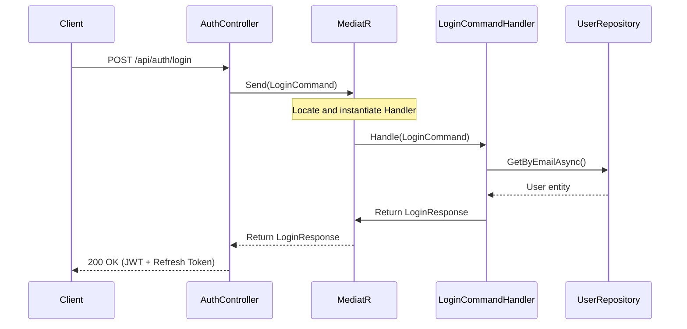

# Mediator Pattern & CQRS Architecture Guide

This document explains the implementation, architecture, and benefits of the **Mediator Pattern** and **CQRS (Command Query Responsibility Segregation)** introduced in the `AuthService` project.

---

## 1. What is the Mediator Pattern?
The Mediator Pattern is a behavioral design pattern that reduces coupling by forcing communication between objects to pass through a central mediator object. 

Instead of controllers injecting multiple service classes directly (tight coupling), they communicate solely with a single mediator: **`IMediator`**. The mediator is responsible for routing commands or queries to their designated single-purpose handlers.

---

## 2. Architecture & Data Flow
When an HTTP request is made to an endpoint in the `AuthController`:
1. The **Controller** acts as a thin gateway. It receives the HTTP request and creates a `Command` (for state changes) or a `Query` (for fetching data).
2. The Controller dispatches the request to the mediator: `await _mediator.Send(command)`.
3. **MediatR** intercepts the command and uses Dependency Injection to find the registered handler for that request type.
4. The **Handler** (e.g., `LoginCommandHandler`) executes the business logic, interacts with repositories, and returns a response back to the mediator.
5. The mediator returns the result to the Controller, which sends it back to the client.



---

## 3. Benefits of this Architecture
1. **Single Responsibility Principle (SRP)**: Each handler does exactly *one thing* (e.g., only registers a user, or only logs in a user). There are no more giant service classes with 10+ unrelated methods.
2. **Thin Controllers**: Controllers contain no business logic. They are only responsible for binding HTTP request models, invoking the mediator, and returning HTTP responses.
3. **Decoupled Code**: Add, modify, or remove features (commands/queries) independently without affecting other features.
4. **Pipeline Behaviors (AOP)**: You can intercept all mediator requests to apply logging, validation, caching, or transaction boundaries in one place without duplicating code.

---

## 4. Folder Structure (Feature-Based)
Inside the `Auth.Application` project, business logic is organized by features (vertical slices) instead of generic layers:

```text
Auth.Application/
└── Features/
    └── Auth/
        └── Commands/
            ├── Register/
            │   ├── RegisterCommand.cs
            │   └── RegisterCommandHandler.cs
            ├── Login/
            │   ├── LoginCommand.cs
            │   └── LoginCommandHandler.cs
            └── Refresh/
                ├── RefreshCommand.cs
                └── RefreshCommandHandler.cs
```

---

## 5. Quick Reference: How to Implement a New Action

### Step 1: Define the Request (Command/Query)
Create a `record` implementing `IRequest<TResponse>` representing your input data contract:
```csharp
using MediatR;

namespace Auth.Application.Features.Auth.Commands
{
    public record RegisterCommand(string Email, string Password) : IRequest<RegisterResponse>;
}
```

### Step 2: Define the Handler
Create a class implementing `IRequestHandler<TRequest, TResponse>` that contains your business logic:
```csharp
using MediatR;

namespace Auth.Application.Features.Auth.Commands
{
    public class RegisterCommandHandler : IRequestHandler<RegisterCommand, RegisterResponse>
    {
        private readonly IUserRepository _repository;

        public RegisterCommandHandler(IUserRepository repository)
        {
            _repository = repository;
        }

        public async Task<RegisterResponse> Handle(RegisterCommand request, CancellationToken cancellationToken)
        {
            // Business Logic here...
            return new RegisterResponse { ... };
        }
    }
}
```

### Step 3: Dispatch from the Controller
Inject `IMediator` and send the command:
```csharp
[HttpPost("register")]
public async Task<IActionResult> Register([FromBody] RegisterRequest request)
{
    var response = await _mediator.Send(new RegisterCommand(request.Email, request.Password));
    return Ok(response);
}
```

---

## 6. How MediatR is Registered
In `Program.cs`, MediatR is registered to automatically scan the `Auth.Application` assembly and register all command/query handlers:
```csharp
builder.Services.AddMediatR(cfg => {
    cfg.RegisterServicesFromAssembly(typeof(RegisterCommand).Assembly);
});
```
