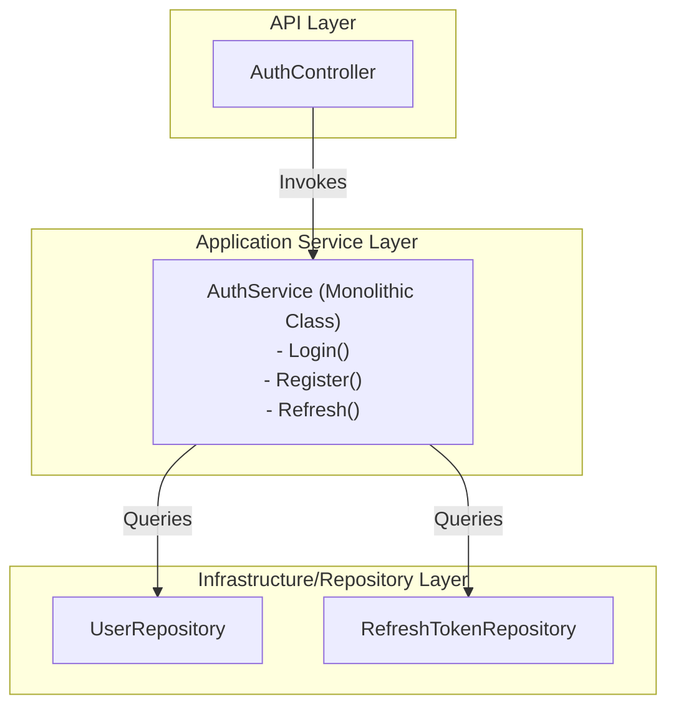
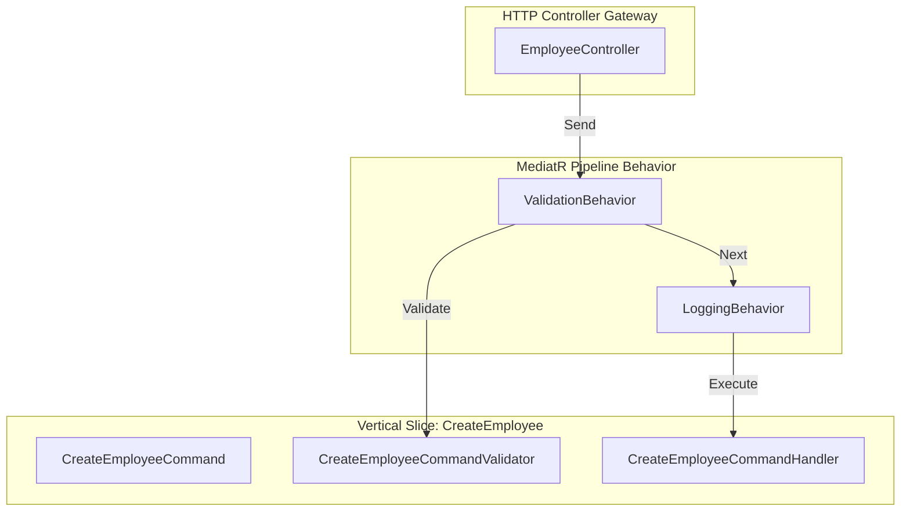

# Architectural Comparison: Controller-Service-Repository vs. Service Mediator Pattern (MediatR)

This document provides a deep architectural analysis of the Leave Management System's transition from the traditional **Controller-Service-Repository** pattern to the **Service Mediator Pattern (MediatR)** with **Vertical Slices**. 

---

## 1. Audit of the Current Implementation

Across the three backend services, here is the current status of the mediator pattern:

### 📊 Service-by-Service Analysis

| Service | Feature folders (Vertical Slices)? | Logging & Validation Pipelines? | Status & Correctness |
| :--- | :--- | :--- | :--- |
| **AuthService** | ✅ Yes (Folder-per-feature) | ✅ Yes | **Excellent**. Fully refactored to Vertical Slice architecture with pipeline validations/logs. |
| **EmployeeService** | ✅ Yes (Folder-per-feature) | ✅ Yes | **Excellent**. Fully refactored to Vertical Slice architecture with pipeline validations/logs. |
| **LeaveService** | ✅ Yes (Folder-per-feature) | ✅ Yes | **Excellent**. Fully refactored to Vertical Slice architecture with pipeline validations/logs. |

### 🔍 Identified Improvements
1. **CQRS Marker Interfaces**: Define `ICommand` and `IQuery` marker interfaces in all three services. This allows targeting specific behaviors (like DB transactions or write-audits) only to Commands, bypassing them for Queries.

---

## 2. Visualizing the Architectures

### A. The Traditional Controller-Service-Repository (Horizontal Layers)
Features are spread horizontally across technical layers. When adding or changing a feature, you must open and change files in every layer.

### B. The MediatR Mediator Pattern (Vertical Slices + Pipeline)
Features are self-contained vertical slices. Cross-cutting concerns are handled transparently by pipeline behaviors before hitting the handler.

---

## 3. Comparison Matrix

| Architectural Quality | Controller-Service-Repository | Service Mediator Pattern |
| :--- | :--- | :--- |
| **Coupling** | **High**. Controllers inject concrete services. Services inject other services and repositories, forming a complex graph. | **Low**. Controllers inject a single `IMediator`. Handlers only inject the exact dependencies they need. |
| **Single Responsibility (SRP)** | **Poor**. Service classes (e.g. `EmployeeService`) accumulate dozens of methods and unrelated dependencies over time. | **High**. A single handler is responsible for executing exactly **one** usecase command or query. |
| **Git & Merge Conflicts** | **Frequent**. Developers working on different features (like Login and Register) edit the same shared service file. | **Rare**. Developers work in completely isolated feature directories. |
| **Cross-Cutting Concerns** | **Repetitive**. Caching, validation, and logging must be manually repeated in service methods or via custom attributes. | **Centralized**. Open behaviors intercept requests globally, separating cross-cutting concerns from business logic. |
| **Unit Testing** | **Complex**. Testing a service method requires mocking all constructor dependencies of the entire service class. | **Simple**. Testing a handler only requires mocking the specific interfaces used in that `Handle()` method. |

---

## 4. When to Use Which Architecture

### Choose **Controller-Service-Repository** when:
1. **Simple CRUD APIs**: The project is tiny, containing basic database reads and writes with minimal business rules (e.g., simple admin panels, rapid prototypes, MVPs).
2. **Small Microservices**: The service has 1-3 endpoints and is unlikely to grow.
3. **Novice Teams**: The team is small, and training developers on MediatR behaviors, pipelines, and CQRS patterns is not worth the architectural overhead.

### Choose **Service Mediator Pattern (MediatR)** when:
1. **Medium-to-Large Applications**: The project has rich business logic, complex database workflows, and is expected to grow.
2. **Parallel Team Development**: Multiple developers are working on the backend simultaneously. Vertical slices prevent them from stepping on each other's code.
3. **Clean Architecture / DDD**: You are separating the Domain model from technical integrations and want to enforce strict boundary validation.
4. **Multiple Ingress Channels**: Your application is accessed by REST APIs, message brokers (Kafka/RabbitMQ), background workers, and integration test suites. The Mediator pipeline ensures validation and logging execute identical logic across all channels.
