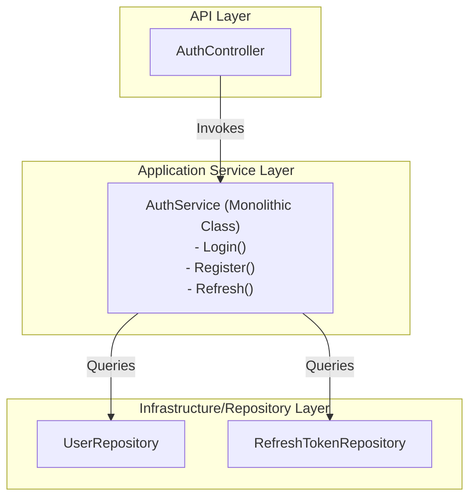
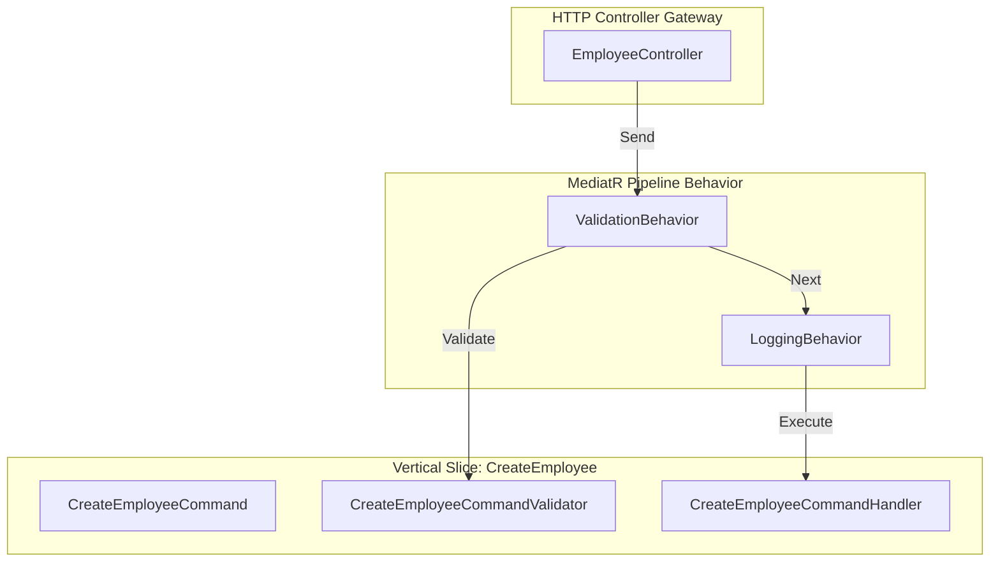

# Architectural Design Guide (V2): Vertical Slices & MediatR Pipelines

This document provides a deep architectural analysis of the Leave Management System's transition from the traditional **Controller-Service-Repository** pattern to the **Service Mediator Pattern (MediatR)** with **Vertical Slices** and **Aspect-Oriented Pipeline Behaviors**.

---

## 1. System Status & Correctness

All three microservices have been successfully refactored and aligned under this architecture:

### 📊 Service-by-Service Verification

| Service | Feature folders (Vertical Slices)? | Logging & Validation Pipelines? | Status & Correctness |
| :--- | :--- | :--- | :--- |
| **AuthService** | ✅ Yes (Folder-per-feature) | ✅ Yes | **Fully Complete**. Login, Register, and Refresh flows refactored into vertical slices with logging and validation pipelines. |
| **EmployeeService** | ✅ Yes (Folder-per-feature) | ✅ Yes | **Fully Complete**. Feature-based slices and pipeline behaviors registered. |
| **LeaveService** | ✅ Yes (Folder-per-feature) | ✅ Yes | **Fully Complete**. Feature-based slices and pipeline behaviors registered. |

---

## 2. Visualizing Layered vs. Vertical Slice Architecture

### A. The Traditional Controller-Service-Repository (Horizontal Layers)
Features are spread horizontally across technical layers. When adding or changing a feature, code changes span multiple files in different layers, raising coupling and git conflict risks.



### B. The MediatR Mediator Pattern (Vertical Slices + Pipeline)
Features are self-contained vertical slices. Changes to a feature are entirely encapsulated within its specific feature folder.



---

## 3. Deep-Dive: MediatR Pipeline Behavior

MediatR behaviors act like an onion wrapper (similar to HTTP middleware but in the application core layer) around your feature handlers.

### 🔄 Request Execution Sequence

```
[ Ingress: HTTP Request / Msg Queue / Unit Test ]
                       │
                       ▼
            ┌──────────────────────┐
            │  IMediator.Send()    │
            └──────────┬───────────┘
                       │
                       ▼
      ┌─────────────────────────────────┐
      │   LoggingBehavior (PRE-LOG)     │ ◄── Starts Stopwatch & logs Request Start
      └────────────────┬────────────────┘
                       │
                       ▼
      ┌─────────────────────────────────┐
      │   ValidationBehavior            │ ◄── Scans DI and runs FluentValidation
      └────────────────┬────────────────┘
                       │
                       ▼
      ┌─────────────────────────────────┐
      │   Target Command Handler        │ ◄── Executes Database & Core Business Logic
      └────────────────┬────────────────┘
                       │
                       ▼
      ┌─────────────────────────────────┐
      │   LoggingBehavior (POST-LOG)    │ ◄── Stops Stopwatch & logs Execution Time
      └────────────────┬────────────────┘
                       │
                       ▼
[ Egress: Returns DTO Response / Throws Exception ]
```

### 🛡️ Exception Propagation Flow
If validation fails or database logic throws an exception during pipeline execution, the exception propagates as follows:
1. The **Command Handler** throws the exception (e.g. `ValidationException` or `NotFoundException`).
2. The exception bubbles up through `ValidationBehavior` and is caught by the `LoggingBehavior` catch-block, which logs the error.
3. `LoggingBehavior` re-throws the exception up to ASP.NET Core.
4. The global `ExceptionMiddleware` catches the exception, maps it to a standard REST response (e.g., `400 Bad Request`), and formats the error JSON for the client.

---

## 4. Comparison Matrix

| Architectural Quality | Controller-Service-Repository | Service Mediator Pattern |
| :--- | :--- | :--- |
| **Coupling** | **High**. Controllers inject concrete service classes. Services inject multiple repositories, creating heavy constructor dependency graphs. | **Low**. Controllers inject a single `IMediator`. Handlers only inject the exact dependencies they need. |
| **Single Responsibility (SRP)** | **Poor**. Service classes accumulate unrelated methods and dependencies over time, growing into massive files. | **High**. A single handler class is responsible for executing exactly **one** command or query. |
| **Git Merge Conflicts** | **Frequent**. Multiple developers editing different business features inside the same monolithic Service file. | **Rare**. Developers work inside isolated feature folders. |
| **Validation Security** | **Vulnerable**. Validation is coupled to HTTP controllers. Non-HTTP entry points (queues, CLI, tests) bypass validation. | **Secure**. Validation runs in the core application layer, guaranteeing validation across all entry points. |
| **Performance Tracking** | **Hard**. Stopwatches and manual performance tracking must be injected into individual methods. | **Easy**. Centralized logging behavior automatically profiles and logs the duration of all requests. |

---

## 5. Architectural Guidelines: When to Use Which

### Use Traditional Controller-Service-Repository when:
1. **Simple CRUD APIs**: The project is small, containing basic database reads and writes with minimal business rules (e.g., simple admin panels, rapid prototypes).
2. **Minimalist Microservices**: The service has 1-3 endpoints and is unlikely to scale in complexity.
3. **Novice Teams**: The team is small, and training developers on MediatR pipelines and CQRS is not worth the architectural overhead.

### Use MediatR Vertical Slices when:
1. **Domain-Driven or Complex APIs**: The project has rich business logic, database transactions, and is expected to grow.
2. **Parallel Team Development**: Multiple developers work on the backend simultaneously. Feature isolation prevents them from overriding each other's code.
3. **Multiple Ingress Channels**: Your application is accessed by REST APIs, message brokers (RabbitMQ/Kafka), background workers, and automated integration tests. The MediatR pipeline ensures consistent validation, security, and logging across all entry points.
