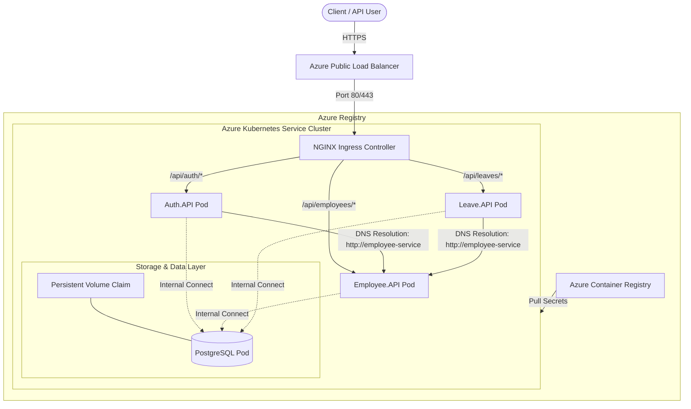
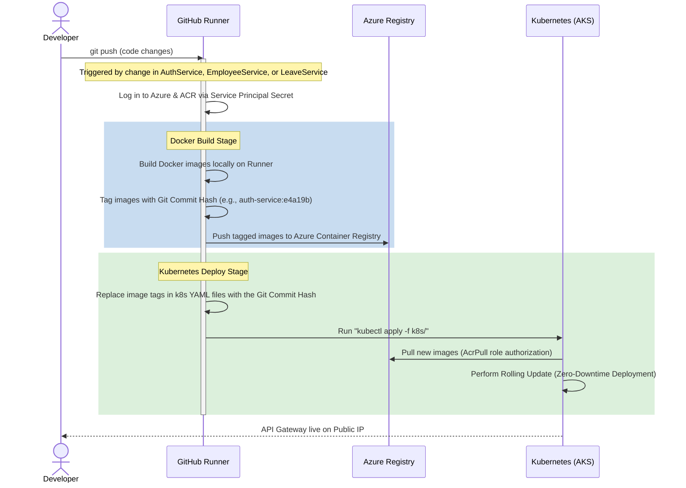

# Leave Management System: Azure AKS Deployment Architecture

This document provides a detailed technical blueprint of the cloud deployment architecture, network routing, and CI/CD pipelines for migrating the **Leave Management System** to **Azure Kubernetes Service (AKS)** using **NGINX Ingress** as the API Gateway.

---

## 1. Cloud Architecture Blueprint

The target deployment model isolates public-facing routing from internal microservice boundaries. All services run inside an AKS cluster, pulling container images from a secure Azure Container Registry (ACR).



---

## 2. Infrastructure Components

### 2.1 Container Registry (ACR)
* **Service**: Azure Container Registry (Basic Tier).
* **Role**: Private storage for Docker images generated by the CI/CD pipeline.
* **Security**: Attached directly to AKS using an Azure Role-Based Access Control (RBAC) role (`AcrPull`), removing the need for manual docker registry credentials within Kubernetes.

### 2.2 Managed Kubernetes (AKS)
* **Service**: Azure Kubernetes Service.
* **Nodes**: 1 Virtual Machine Node (Size: `Standard_B2s` or `Standard_D2s_v5` running Linux).
* **Network Plugin**: Kubenet (default, cost-effective for single-node development) or Azure CNI (for enterprise vnets).

### 2.3 API Gateway & Ingress (NGINX)
* **Service**: NGINX Ingress Controller deployed inside AKS.
* **Role**: 
  * Acts as the single entry point (API Gateway) for client applications.
  * Discovers endpoints and routes incoming traffic dynamically based on request paths.
  * Translates paths:
    * Routing `/api/auth/*` $\rightarrow$ `auth-service:80`
    * Routing `/api/employees/*` $\rightarrow$ `employee-service:80`
    * Routing `/api/leaves/*` $\rightarrow$ `leave-service:80`

### 2.4 Database State Preservation
* **Service**: PostgreSQL containerized as a K8s Deployment/StatefulSet.
* **Storage**: Azure Disk (Standard SSD LRS) mapped via a `PersistentVolumeClaim` (PVC) inside AKS. This ensures database files are kept safe even if the database container restarts or is rescheduled.
* **Schema Isolation**: The PostgreSQL instance initializes a single database (`employeeleave`) containing three isolated schemas: `auth`, `employee`, and `leave`, matching local development structures.

---

## 3. Configuration & Secrets Management

To maintain a secure, decoupled setup, configuration settings are injected at runtime using Kubernetes resources:

1. **ConfigMaps**:
   * Storage of non-sensitive environmental values.
   * Examples: Database connection URLs, internal client service URLs, logging levels, database init strategy configurations (`DatabaseSettings:InitStrategy`).
2. **Secrets**:
   * Storage of sensitive credentials.
   * Examples: Database admin password, JWT encryption key, JWT Refresh Token secrets.
   * Configured as environment variables inside the API pods.

---

## 4. GitHub Actions CI/CD Pipeline Flow

The deployment process is automated from source control down to Azure using GitHub Actions.



---

## 5. File Structure for Deployment Manifests

We will add a `/k8s` configuration folder to the root of the project to organize Kubernetes resources:

```text
LeaveManagement/
├── k8s/
│   ├── postgres-pvc.yaml       # Azure Disk persistent storage config
│   ├── postgres-deploy.yaml    # Database container configuration
│   ├── configmap.yaml          # Shared environmental variables
│   ├── secrets.yaml            # Sensitive API passwords and JWT secrets
│   ├── auth-service.yaml       # Auth microservice deployment and service
│   ├── employee-service.yaml   # Employee microservice deployment and service
│   ├── leave-service.yaml      # Leave microservice deployment and service
│   └── ingress.yaml            # API Gateway path routing definitions
├── .github/
│   └── workflows/
│       └── deploy.yml          # GitHub Actions CI/CD workflow
```

---

## 6. Action Plan for Execution

1. **Step 1**: Create Dockerfiles for `Auth.API`, `Employee.API`, and `Leave.API`.
2. **Step 2**: Write standard Kubernetes manifests (`/k8s` folder).
3. **Step 3**: Spin up Azure infrastructure (ACR and AKS) using Azure CLI commands.
4. **Step 4**: Install the NGINX Ingress Controller on AKS.
5. **Step 5**: Write and configure the GitHub Actions workflow for deployment.
6. **Step 6**: Verify and test the API gateway endpoints.