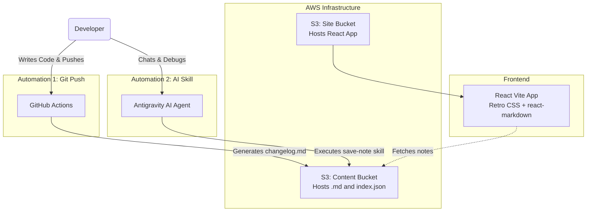

# 🎮 Building a Retro Notes Website with S3 and AI

**Date:** 2026-07-06
**Tags:** react, aws, s3, automation, ai, architecture

## What We Built

We designed and deployed a **Minecraft/Retro Arcade-themed personal knowledge base** to store and display learning notes. 

Instead of dealing with databases and backend servers, we used a fully serverless, highly-scalable approach using AWS S3 for both storage and hosting, combined with a React (Vite) frontend.

## The Architecture

The entire system relies on static file hosting and two separate automation pipelines.

## Key Learnings & Decisions

### 1. Zero-Server Hosting with S3
By separating the **frontend app** (`prashant-learning-notes-site`) and the **content** (`prashant-learning-notes-content`) into two different S3 buckets, we achieve a system that costs fractions of a penny per month and requires zero maintenance. 
* To make it work, the content bucket needs a `Bucket Policy` allowing `s3:GetObject` and a `CORS` policy allowing `GET` requests from the site.

### 2. Rendering Markdown & Mermaid in React
We utilized `react-markdown` to render the raw `.md` files fetched from S3. 
> [!WARNING] 
> **Bug Encountered:** If you forget to pass the `children={content}` prop to the `<ReactMarkdown>` component, it will silently render a blank page even if the network fetch succeeds!

To support Mermaid diagrams, we intercepted `code` blocks with the language `mermaid` and used the official `mermaid` library to render SVGs dynamically in the browser.

### 3. Dual Automation Pipelines
Instead of manually writing notes, the system is fed by two autonomous pipelines:
* **The Code Push Pipeline:** A GitHub Action that reads `git diff`, writes an `auto-commit` markdown file, and pushes it to S3 on every merge to `main`.
* **The AI Skill Pipeline:** An Antigravity custom skill (`save-note`) that allows the AI agent to analyze the conversation history, extract the "Why" and "How", generate a rich markdown tutorial, and deploy it instantly via the AWS CLI.

This creates a self-documenting project where both code changes and human learning experiences are permanently captured!
