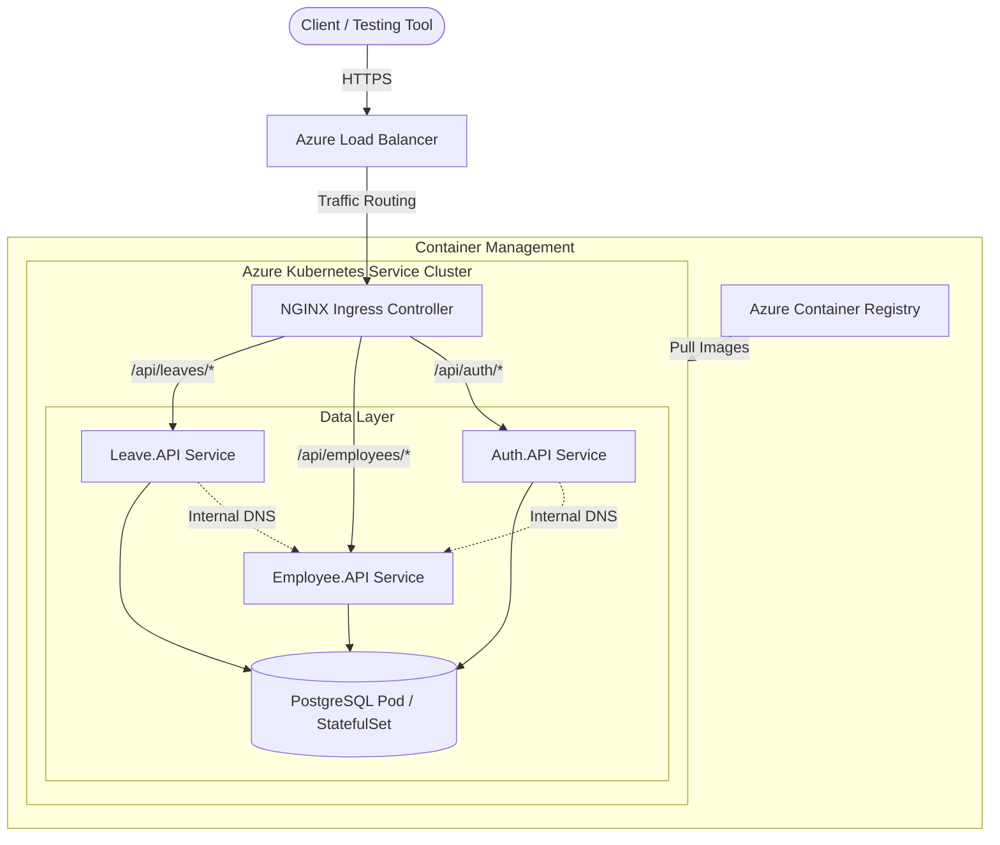
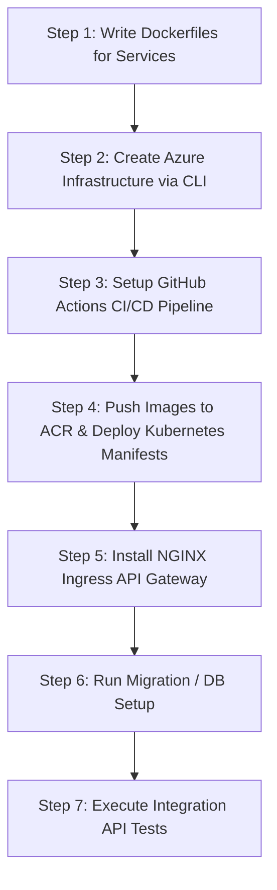

# Deployment & Cost Analysis: Leave Management System on Azure

This document outlines the architecture, step-by-step deployment workflow, and estimated costs for migrating and deploying the **Leave Management System** (composed of `AuthService`, `EmployeeService`, and `LeaveService`) to a Dockerized Kubernetes environment on **Microsoft Azure**.

---

## 1. Target Architecture Overview

To achieve a clean, industry-standard microservices deployment, we will build the following structure on Azure:

### Architectural Decisions & Explanations:
1. **Azure Container Registry (ACR)**: A private Docker registry hosted in Azure to securely store your container images.
2. **Azure Kubernetes Service (AKS)**: A managed Kubernetes cluster. Since you are new to Kubernetes, AKS simplifies cluster management (Azure manages the control plane for free; you only pay for the virtual machines running as worker nodes).
3. **API Gateway (Kubernetes Ingress)**: Instead of costly managed options like Azure API Management (APIM), we will run an **NGINX Ingress Controller** inside your AKS cluster. It acts as the API Gateway, handling routing, SSL/TLS termination, and mapping `/api/auth` to `AuthService`, `/api/employees` to `EmployeeService`, etc.
4. **PostgreSQL Database**:
   * *Option A (Cost-Saving Dev/Test)*: Run a PostgreSQL container inside the AKS cluster (using a Persistent Volume for data storage). **Cost: $0 extra.**
   * *Option B (Production Grade)*: Use **Azure Database for PostgreSQL (Flexible Server)**. **Cost: ~$15–$30/month.**

---

## 2. Dev/Testing Cost Estimation (Pay-As-You-Go)

Since you are using a Pay-As-You-Go subscription, you only pay for what runs. Here is the cost breakdown for a lightweight development and testing environment:

### Cost Breakdown (Assuming 24/7 run-time)

| Resource | Size / Tier | Monthly Cost (Est.) | Hourly Cost (Est.) | Notes |
| :--- | :--- | :--- | :--- | :--- |
| **AKS Cluster Node** | 1x `Standard_D2s_v5` (2 vCPU, 8GB RAM) | ~$70.00 | ~$0.096 | Runs all 3 .NET microservices and Ingress. |
| **Azure Container Registry (ACR)** | Basic Tier | ~$5.00 | ~$0.007 | Private Docker registry with 10GB storage. |
| **Azure Load Balancer & Public IP** | Standard | ~$3.00 | ~$0.004 | Created automatically by Ingress for public access. |
| **OS & Persistent Disk Storage** | 32GB Standard SSD | ~$2.40 | ~$0.003 | Used for VM OS and database volumes. |
| **Managed Postgres (Optional)** | Burstable `B1ms` (1 vCPU, 2GB RAM) | ~$15.00 | ~$0.020 | Only if using Azure Database for Postgres. |
| **Total (Database inside K8s)** | **Single-Node AKS** | **~$80.00 / month** | **~$0.11 / hour** | **Highly Recommended for testing.** |
| **Total (Managed Postgres)** | **Flexible Server + AKS** | **~$95.00 / month** | **~$0.13 / hour** | Production-grade setup. |

> [!TIP]
> **How to keep costs near zero:**
> 1. **Stop the AKS cluster** when you are not actively developing or testing. Azure allows you to stop the cluster with a single click/command, which stops VM billing entirely (you only pay ~$2/month for inactive disk storage).
> 2. **Delete the Resource Group** when you are completely finished with this deployment practice. This deletes all resources instantly, ensuring you don't get billed further.

---

## 3. Step-by-Step Deployment & CI/CD Workflow

Here is the exact roadmap we will follow to build, deploy, and test the Leave Management System:

### Step 1: Dockerization
Write optimized, multi-stage `Dockerfiles` for each service (`AuthService`, `EmployeeService`, `LeaveService`) targeted at **.NET 10.0**. This keeps the final image size small (under 100MB).

### Step 2: Provision Azure Resources
Use the Azure CLI to create:
* A Resource Group.
* An Azure Container Registry (ACR).
* A single-node AKS cluster linked to your ACR (so the cluster has permissions to pull images).

### Step 3: CI/CD Pipeline Configuration
Create a **GitHub Actions** workflow (`.github/workflows/deploy.yml`) that triggers on code push:
1. Log in to Azure and ACR.
2. Build the Docker images for all three services.
3. Push the images to ACR with unique tags (commit SHA).
4. Substitute the image tags into the Kubernetes manifest files.
5. Deploy the manifests to AKS using `kubectl apply`.

### Step 4: Kubernetes Manifests & API Routing
Draft Kubernetes manifests for:
* **Deployments**: Desired state for running container replicas.
* **Services**: Internal stable network endpoints inside the cluster.
* **Secrets/ConfigMaps**: Environmental variables, database connection strings, and JWT keys.
* **Ingress**: Mappings that route traffic:
  * `http://<Public-IP>/api/auth/*` $\rightarrow$ `AuthService`
  * `http://<Public-IP>/api/employees/*` $\rightarrow$ `EmployeeService`
  * `http://<Public-IP>/api/leaves/*` $\rightarrow$ `LeaveService`

### Step 5: Database Setup and Testing
Configure database initialization strategies (automatically running EF Core migrations on start) and run testing calls (via `curl` or Postman scripts) against the public ingress IP to ensure the Auth flow, token exchanges, and database connections work correctly.

---

## 4. Key Questions & Next Steps

Before we start writing code and infrastructure configurations, let's align on a few choices:

1. **Database Strategy**: Do you want to run PostgreSQL inside the Kubernetes cluster (cheapest/easiest to clean up) or use a managed Azure PostgreSQL service?
2. **CI/CD Platform**: Are you using **GitHub** for repository hosting? (If so, GitHub Actions is the easiest pipeline tool to set up).
3. **Local CLI Access**: Do you have the Azure CLI (`az`) and Docker installed locally on your system, or do you want to install them first?
