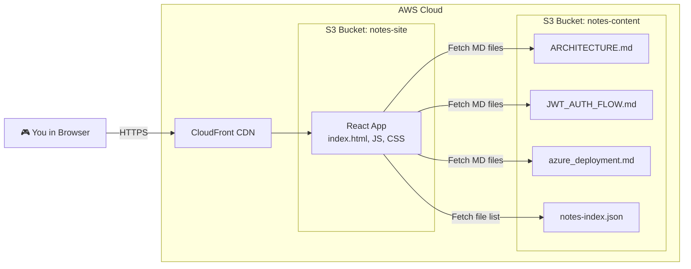
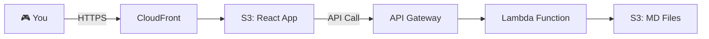

# 🎮 Retro Notes Website — Architecture Analysis

## What You Asked For
A **Minecraft / Retro Arcade themed** personal notes website where:
- All your `.md` learning files are stored in AWS S3
- A React frontend fetches and renders them beautifully
- Full **Mermaid diagram** support rendered directly in the browser
- Deployed entirely on AWS

---

## Your Existing Markdown Notes

Found **5 markdown files** in your project root:

| File | Size | Has Mermaid Diagrams? |
| :--- | :--- | :--- |
| [ARCHITECTURE.md](file:///home/prashant-kumar/Desktop/LeaveManagement/ARCHITECTURE.md) | 10.8 KB | ✅ Yes |
| [MEDIATOR_PATTERN_GUIDE.md](file:///home/prashant-kumar/Desktop/LeaveManagement/MEDIATOR_PATTERN_GUIDE.md) | 5.0 KB | ✅ Yes |
| [azure_deployment_architecture.md](file:///home/prashant-kumar/Desktop/LeaveManagement/azure_deployment_architecture.md) | 6.5 KB | ✅ Yes |
| [JWT_AUTH_FLOW.md](file:///home/prashant-kumar/Desktop/LeaveManagement/JWT_AUTH_FLOW.md) | 4.4 KB | ❌ No |
| [DEVELOPER_WORKFLOW_GUIDE.md](file:///home/prashant-kumar/Desktop/LeaveManagement/DEVELOPER_WORKFLOW_GUIDE.md) | 3.3 KB | ❌ No |

---

## Architecture Options

### Option A: S3 Static Website + CloudFront (Recommended ✅)

This is the **simplest, cheapest, and most professional** approach.

**How it works:**
1. **S3 Bucket 1 (`notes-content`)**: Stores your raw `.md` files and a `notes-index.json` manifest file (a simple JSON list of all note filenames, titles, and tags).
2. **S3 Bucket 2 (`notes-site`)**: Hosts the compiled React app as a static website (just HTML/JS/CSS files).
3. **CloudFront**: A CDN (Content Delivery Network) that sits in front of both buckets, gives you a clean HTTPS URL, and caches your site globally for blazing-fast load times.
4. **React App**: On page load, it fetches `notes-index.json` to build the sidebar/navigation. When you click a note, it fetches the raw `.md` file from S3 and renders it in the browser using `react-markdown` + `mermaid.js`.

**Why this is the best option:**
- **No servers to manage.** No EC2 instances, no containers, no Kubernetes. Just static files.
- **Virtually free.** S3 storage for a few KB of markdown files costs fractions of a penny. CloudFront free tier gives you 1TB of data transfer per month.
- **Lightning fast.** CloudFront edge servers cache your site in data centers worldwide.
- **Easy to update.** To add a new note, just upload the `.md` file to S3 and update the JSON manifest.

---

### Option B: S3 + API Gateway + Lambda

**How it works:**
- Instead of the React app fetching directly from S3, a Lambda function acts as a middleman.
- The Lambda lists files from S3 dynamically (no manual JSON manifest needed).
- API Gateway exposes the Lambda as a REST endpoint.

**When to use this:**
- If you want to add features like **search**, **tagging**, or **authentication** in the future.
- If you want the file list to be fully automatic (no manual manifest updates).

> [!NOTE]
> For your current use case (personal notes, ~5 files), **Option A is overkill-free and perfect**. We can always upgrade to Option B later if your needs grow.

---

## Recommended Architecture: Option A

### Tech Stack

| Layer | Technology | Purpose |
| :--- | :--- | :--- |
| **Frontend Framework** | React (Vite) | Fast builds, modern tooling |
| **Styling** | Vanilla CSS with pixel-art fonts | Minecraft / retro arcade aesthetic |
| **Markdown Renderer** | `react-markdown` + `remark-gfm` | Renders `.md` files with GitHub-flavored markdown (tables, code blocks) |
| **Mermaid Diagrams** | `mermaid.js` | Renders `mermaid` code blocks as interactive SVG diagrams |
| **Code Syntax Highlighting** | `react-syntax-highlighter` | Colors your code blocks (C#, bash, YAML, etc.) |
| **Hosting** | AWS S3 + CloudFront | Static website hosting with HTTPS and CDN |
| **Storage** | AWS S3 | Stores your raw `.md` note files |
| **Deployment** | AWS CLI (`aws s3 sync`) | One-command deployment from your terminal |

---

### Design Vision: Retro Arcade / Minecraft Theme

The UI will feature:
- **Pixel-art fonts** (like "Press Start 2P" from Google Fonts)
- **Dark background** with neon green / amber terminal-style text
- **Blocky, pixelated borders** and buttons (Minecraft-style)
- **Scanline overlay effect** on the background (old CRT monitor feel)
- **8-bit hover animations** on clickable elements
- **Sidebar** styled like an inventory menu listing all your notes
- **Main content area** rendering markdown with a "terminal window" aesthetic
- **Mermaid diagrams** rendered inline with a glow effect

---

### Estimated AWS Cost

| Resource | Monthly Cost |
| :--- | :--- |
| S3 Storage (few KB of files) | **$0.01** |
| CloudFront (free tier: 1TB transfer) | **$0.00** |
| **Total** | **~$0.01 / month** |

> [!TIP]
> This is essentially **free forever** for a personal notes site.

---

## Execution Plan

1. **Step 1**: Create the React (Vite) app with retro arcade UI, markdown rendering, and Mermaid support.
2. **Step 2**: Create an S3 bucket for your notes content, upload your 5 `.md` files and a `notes-index.json` manifest.
3. **Step 3**: Create an S3 bucket for the React static site and configure it for static website hosting.
4. **Step 4**: Set up CloudFront distribution for HTTPS and caching.
5. **Step 5**: Deploy the React build output to S3 using `aws s3 sync`.
6. **Step 6**: Test the live site and verify Mermaid diagrams render correctly.

---

## What I Need From You

Before we start building:
1. **AWS CLI**: Do you have the AWS CLI installed? (`aws --version`)
2. **AWS Credentials**: You mentioned you can provide credentials. I'll need you to run `aws configure` to set them up.
3. **Design confirmation**: Are you happy with the Minecraft/retro arcade theme described above, or do you want any changes?
