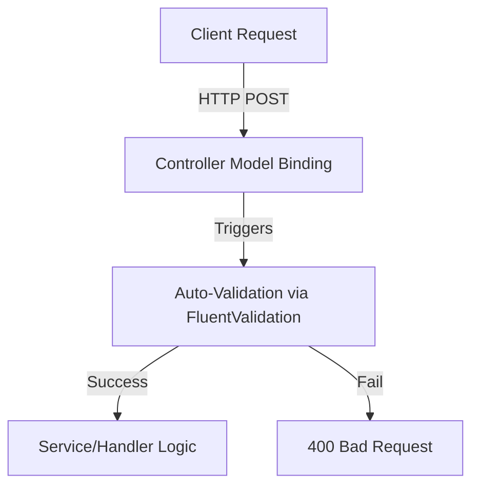
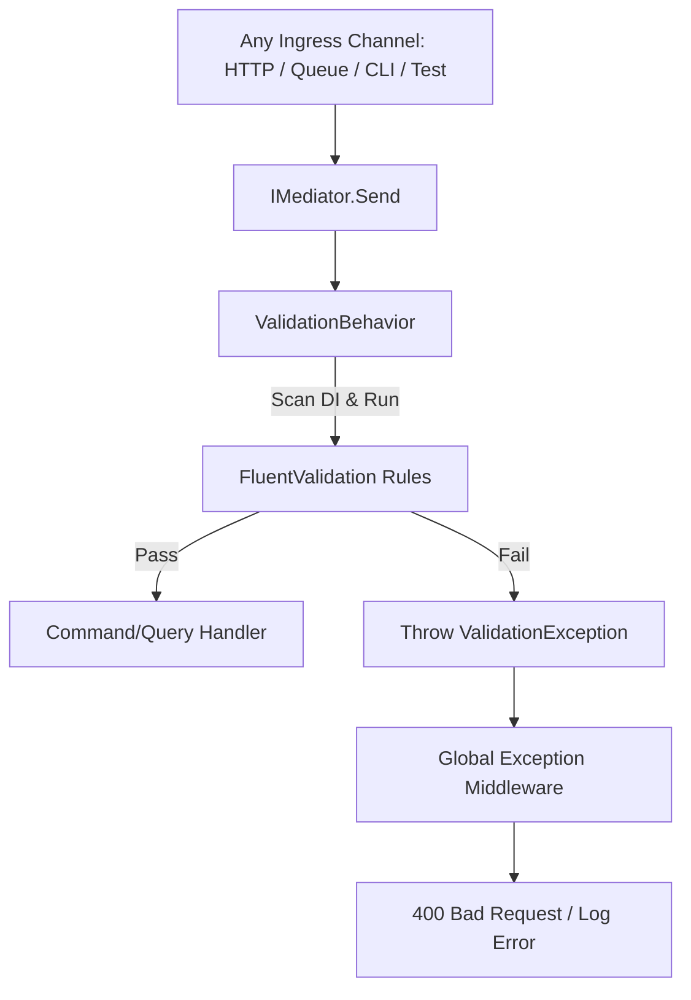

# Logging & Validation: Traditional vs. Pipeline Behavior (Aspect-Oriented Programming)

This document analyzes the differences, benefits, and mechanics of moving cross-cutting concerns (Logging and Validation) from individual service layers and controllers into centralized **MediatR Pipeline Behaviors**.

---

## 1. Logging Comparison

### 🔴 The Old Way: Manual Handler Logging
Previously, logging was manually written at the start and end of every business handler.

#### Code Example (Before):
```csharp
public async Task<EmployeeResponse> CreateEmployeeAsync(CreateEmployeeRequest request)
{
    // 1. Manually log the start of request
    _logger.LogInformation("Creating employee for UserId: {UserId}", request.UserId);

    try
    {
        // Actual business logic...
        
        // 2. Manually log success
        _logger.LogInformation("Employee created successfully with Id: {EmployeeId}", employee.Id);
        return response;
    }
    catch (Exception ex)
    {
        // 3. Manually log failures
        _logger.LogError(ex, "Failed to create employee for UserId: {UserId}", request.UserId);
        throw;
    }
}
```
*   **The Issue**: If you have 50 handlers, you must copy-paste this boilerplate try-catch-logging code 50 times. It clutters your business logic and is highly prone to developer omission.

### 🟢 The New Way: MediatR Logging Behavior
We intercept all requests in a single, reusable middleware called the `LoggingBehavior`.

#### Code Example (Now):
```csharp
public class LoggingBehavior<TRequest, TResponse> : IPipelineBehavior<TRequest, TResponse>
    where TRequest : IRequest<TResponse>
{
    private readonly ILogger<LoggingBehavior<TRequest, TResponse>> _logger;

    public async Task<TResponse> Handle(TRequest request, RequestHandlerDelegate<TResponse> next, CancellationToken cancellationToken)
    {
        var requestName = typeof(TRequest).Name;
        // 1. Logs automatically before any handler executes
        _logger.LogInformation("Starting request {RequestName}", requestName);
        var stopwatch = Stopwatch.StartNew();

        try
        {
            var response = await next(); // 2. Hands execution to the actual handler
            stopwatch.Stop();
            
            // 3. Logs performance automatically
            _logger.LogInformation("Completed request {RequestName} in {ElapsedMilliseconds}ms", requestName, stopwatch.ElapsedMilliseconds);
            return response;
        }
        catch (Exception ex)
        {
            // 4. Logs any unexpected exceptions automatically
            _logger.LogError(ex, "Request {RequestName} failed", requestName);
            throw;
        }
    }
}
```
*   **Why it's better**: Your handlers are 100% focused on business logic. Start, complete, execution time, and error logs are generated automatically for every API.

---

## 2. Validation Comparison

### 🔴 The Old Way: Controller DTO Validation (MVC Auto-Validation)
Previously, FluentValidation was registered at the MVC Controller boundary using `AddFluentValidationAutoValidation()`.



*   **The Vulnerability**: Validation only runs when the request goes through an **HTTP Controller**. If your application invokes the handler from:
    *   An asynchronous message broker consumer (e.g., RabbitMQ, Kafka)
    *   A scheduled background service (e.g., Quartz, HostedService)
    *   A Command Line Interface (CLI) tool
    *   Unit or Integration Test suites
    
    The request **bypasses validation entirely**, allowing corrupted or invalid data to reach the database.

### 🟢 The New Way: MediatR Pipeline Validation
We move validation into the MediatR Pipeline, intercepting the request *inside* the Application Layer.



*   **Why it's better**:
    1.  **Guaranteed Execution**: Regardless of *how* the command is triggered (HTTP, Queue, Test, Console), it passes through the mediator pipeline and is guaranteed to be validated.
    2.  **Valid State at Boundaries**: Your Handlers are cleaner because they are guaranteed to receive only fully valid data models.

---

## 3. Comparison Matrix

| Quality Metric | Traditional MVC/Service Approach | MediatR Pipeline Behavior (AOP) |
| :--- | :--- | :--- |
| **Code Duplication** | **High**. Logging and try-catch boilerplate is repeated in every service method. | **Zero**. Behaviors are written once and applied globally to all requests. |
| **Ingress Decoupling** | **Low**. Validation is coupled to HTTP controllers and model binders. | **High**. Validation is independent of HTTP, running inside the core application layer. |
| **Performance Tracking** | **Hard**. Stopwatches must be manually added to individual methods to measure speeds. | **Easy**. The logging behavior captures and logs execution time for every single request. |
| **Handler Cleanliness** | **Cluttered**. Handlers mix business logic with validation, logging, and error tracing. | **Pure**. Handlers contain *only* code related to database execution and business logic. |
